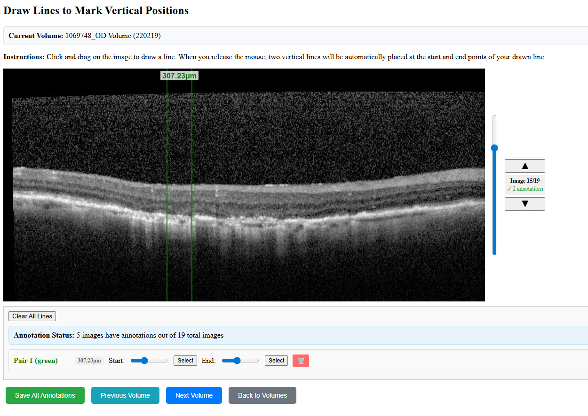

# GA Segmentation App

A web-based application for annotating medical images with vertical line markers. This tool allows users to draw lines across images and automatically generates vertical markers at the start and end points of each drawn line.

## Features

- **Interactive Line Drawing**: Click and drag to draw lines across images
- **Automatic Vertical Markers**: Two vertical lines are automatically placed at the start and end points of each drawn line
- **Edge-Snapping Behavior**: Lines remain at their last valid position when dragging outside image bounds
- **Color-Coded Pairs**: Each line pair is assigned a unique color for easy identification
- **Pair Management**: Lines are grouped in pairs with intuitive controls
- **Image Navigation**: Browse through multiple images in a volume
- **Volume Navigation**: Navigate between volumes with Previous/Next Volume buttons
- **Annotation Persistence**: Save and load annotations in CSV format
- **Real-time Preview**: See exactly where vertical lines will be placed while drawing
- **Batch Annotation Workflow**: Save annotations and automatically move to next/previous volume

## Installation

### Option 1: Docker (Recommended)

#### Prerequisites
- Docker
- Docker Compose

#### Setup with Docker

1. Clone or download the repository
2. Prepare your image directory structure:
   ```
   your-images/
   ├── volume1/
   │   ├── image1.png
   │   ├── image2.jpg
   │   └── ...
   ├── volume2/
   │   ├── image1.png
   │   └── ...
   └── ...
   ```
3. Update the docker-compose.yml file to point to your images directory:
   ```yaml
   volumes:
     - /path/to/your/images:/app/images:ro
   ```
4. Build and run with Docker Compose:
   ```bash
   docker-compose up --build
   ```
5. Open your web browser and navigate to `http://localhost:5005`

#### Alternative Docker Commands

**Build and run the image:**
```bash
docker build -t qtim/ga-segmentation-app .
cp .env_sample .env
docker compose up -d
```

### Option 2: Local Python Installation

#### Prerequisites
- Python 3.7 or higher
- Flask
- PIL (Pillow)

#### Setup

1. Clone or download the repository
2. Install required dependencies:
   ```bash
   pip install -r requirements.txt
   ```
3. Ensure your image directory structure follows the expected format:
   ```
   images/
   ├── volume1/
   │   ├── image1.png
   │   ├── image2.jpg
   │   └── ...
   ├── volume2/
   │   ├── image1.png
   │   └── ...
   └── ...
   ```

#### Running the Application

**Using image paths file (Required)**
1. Create a CSV file with volume-to-path mappings:
   ```csv
   id,file_path_coris
   volume1,/path/to/volume1/images
   volume2,/path/to/volume2/images
   10332,/persist/PACS/VisupacImages/10332/508134
   ```
2. Start the Flask application with the paths file:
   ```bash
   # Using default column names (id, file_path_coris)
   python app.py --image-paths /path/to/image_paths.csv
   
   # Using custom column names
   python app.py --image-paths /path/to/image_paths.csv --volume-column "Volume Name" --path-column "Image Path"
   ```

**Note**: The image paths file is now required. The app will only show volumes that are defined in the CSV file.

3. Open your web browser and navigate to `http://localhost:5005`

### Command Line Arguments

The application supports the following command line arguments:

- `--host`: Host address to bind to (default: 0.0.0.0)
- `--port`: Port to listen on (default: 5005)
- `--image-paths`: CSV file containing image paths mapping
- `--volume-column`: Name of the volume column in the CSV file (default: id)
- `--path-column`: Name of the path column in the CSV file (default: file_path_coris)

**Example with custom columns:**
```bash
python app.py --image-paths data.csv --volume-column "Study ID" --path-column "Directory Path" --port 8080
```

## Usage

### Getting Started

1. **Select a Volume**: On the main page, click on a volume name to start annotating
2. **Image Navigation**: Use the vertical scrollbar, arrow keys, or mouse wheel to navigate between images
3. **Drawing Lines**: Click and drag across the image to draw a line
4. **Volume Navigation**: Use the Previous Volume and Next Volume buttons to move between volumes while automatically saving your work

### Drawing Annotations

#### Method 1: Drag-to-Draw (Recommended)
1. **Click** anywhere on the image to start drawing
2. **Drag** your mouse across the image in any direction
3. **Release** the mouse button to complete the line
4. Two vertical lines will automatically appear at the start and end points

#### Canceling Line Drawing
While drawing a line, you can cancel the operation using:
- **Right-click and release** - Cancels the current line drawing
- **Esc key** - Cancels the current line drawing



### Managing Line Pairs

Each drawn line creates a pair of vertical lines that are grouped together in the control panel:

#### Line Pair Controls
- **Pair Information**: Shows pair number and color
- **Start Line**: Slider to adjust the left vertical line position
- **End Line**: Slider to adjust the right vertical line position
- **Select Buttons**: Click to select individual lines for keyboard editing
- **Remove Button**: Click the trash icon (🗑️) to remove the entire pair

#### Keyboard Shortcuts
- **Arrow Keys**: Move selected line left/right by 1 pixel
- **Backspace**: Remove the selected line or last line if none selected
- **Up/Down Arrow**: Navigate between images
- **Esc**: Cancel current line drawing operation

### Edge Behavior

When drawing lines near or beyond image boundaries:

- **Within Bounds**: Lines follow your mouse normally
- **Outside Bounds**: Lines freeze at their last valid position within the image
- **No Edge Snapping**: Lines remain at their current positions when the mouse goes outside the image

### Color System

The application uses an automatic color sequence:
1. Red
2. Blue  
3. Green
4. Orange
5. Purple
6. Cyan
7. Magenta
8. Yellow

Colors cycle through this sequence for each new line pair, maintaining consistency even when pairs are deleted.

### Volume Navigation

The application provides convenient buttons for navigating between volumes:

#### Navigation Buttons

- **Save All Annotations** (Green): Save annotations for the current volume
- **Previous Volume** (Teal): Save current annotations and navigate to the previous volume
- **Next Volume** (Blue): Save current annotations and navigate to the next volume  
- **Back to Volumes** (Gray): Return to the volume selection page

#### Volume Navigation Workflow

1. **Annotate Images**: Draw lines and add annotations to images in the current volume
2. **Navigate Between Volumes**: Use Previous/Next Volume buttons to move between volumes
3. **Automatic Saving**: Annotations are automatically saved before navigation
4. **Confirmation Dialog**: A confirmation dialog shows how many images have annotations before navigating
5. **Edge Case Handling**: 
   - On the first volume: Previous Volume returns to volume list
   - On the last volume: Next Volume returns to volume list

#### Annotation Status Display

The interface shows real-time information about your annotation progress:

- **Current Volume**: Displays the name of the volume you're currently working on
- **Annotation Count**: Shows how many images have annotations out of the total images
- **Current Image Status**: Shows whether the current image has annotations and how many

### Saving Annotations

1. Click the **"Save All Annotations"** button to save all annotations for the current volume
2. Annotations are saved as CSV files in the `output/` directory
3. Each volume gets its own file: `{volume_name}_lines.csv`
4. The CSV format includes: volume_id, index, filepath, line_index, x_coordinate, color
5. **Automatic Saving**: Previous/Next Volume buttons automatically save annotations before navigation

### File Structure

```
ga_segmentation_app/
├── app.py                 # Flask application
├── templates/
│   ├── index.html        # Main annotation interface
│   └── volumes.html      # Volume selection page
├── output/               # Generated annotation files
│   └── *.csv            # Annotation data
└── images/              # Image directory (external)
    └── volumes/         # Volume subdirectories
```

## Data Format

### CSV Output Format

The application saves annotations in CSV format with the following columns:

| Column | Description |
|--------|-------------|
| volume_id | Name of the volume |
| index | Image index within the volume |
| filepath | Filename of the image |
| line_index | Index of the line within the pair (0 or 1) |
| x | X-coordinate of the vertical line |
| color | Color of the line pair (red, blue, green, etc.) |

### Example CSV Output

```csv
volume_id,index,filepath,line_index,x,color
Volume1,0,image001.png,0,150.5,red
Volume1,0,image001.png,1,300.2,red
Volume1,1,image002.png,0,200.0,blue
Volume1,1,image002.png,1,450.8,blue
```

## Troubleshooting

### Common Issues

1. **Images not loading**: Check that the image directory path in `app.py` is correct
2. **J2K files not displaying**: The app automatically converts J2K/JP2 files to JPEG for display
3. **Annotations not saving**: Ensure the `output/` directory exists and is writable
4. **Lines not appearing**: Check browser console for JavaScript errors

### Browser Compatibility

- Chrome (recommended)
- Firefox
- Safari
- Edge

## Technical Details

### Backend
- **Framework**: Flask (Python)
- **Image Processing**: PIL/Pillow
- **Data Format**: CSV

### Frontend
- **Canvas API**: For drawing and line rendering
- **JavaScript**: Event handling and UI interactions
- **CSS**: Responsive design and styling

### Performance
- Images are served directly from the file system
- J2K/JP2 files are converted on-the-fly to JPEG
- Canvas rendering provides smooth real-time feedback

## Contributing

To contribute to this project:

1. Fork the repository
2. Create a feature branch
3. Make your changes
4. Test thoroughly
5. Submit a pull request

## License

[Add your license information here]

## Support

For technical support or questions, please [add contact information or issue tracker link].
